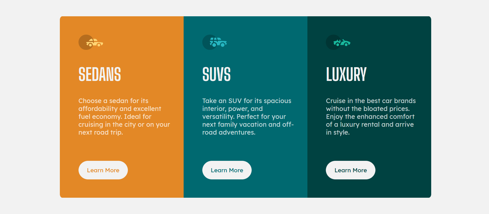

# Frontend Mentor - 3-column preview card component solution

This is a solution to the [3-column preview card component challenge on Frontend Mentor](https://www.frontendmentor.io/challenges/3column-preview-card-component-pH92eAR2-). Frontend Mentor challenges help you improve your coding skills by building realistic projects. 

## Table of contents

- [Overview](#overview)
  - [The challenge](#the-challenge)
  - [Screenshot](#screenshot)
- [My process](#my-process)
  - [Built with](#built-with)
  - [What I learned](#what-i-learned)
- [Author](#author)

## Overview

### The challenge

Users should be able to:

- View the optimal layout depending on their device's screen size
- See hover states for interactive elements

### Screenshot

## My process

### Built with

- Semantic HTML5 markup
- SCSS custom properties
- Flexbox

### What I learned

This was another challenge where I put my Flexbox skills to test. I began visualizing the layout with CSS Grid, but found out that Flexbox was better suited and a bit easier to work with this design.

## Author

- Frontend Mentor - [@jwar28](https://www.frontendmentor.io/profile/jwar28)